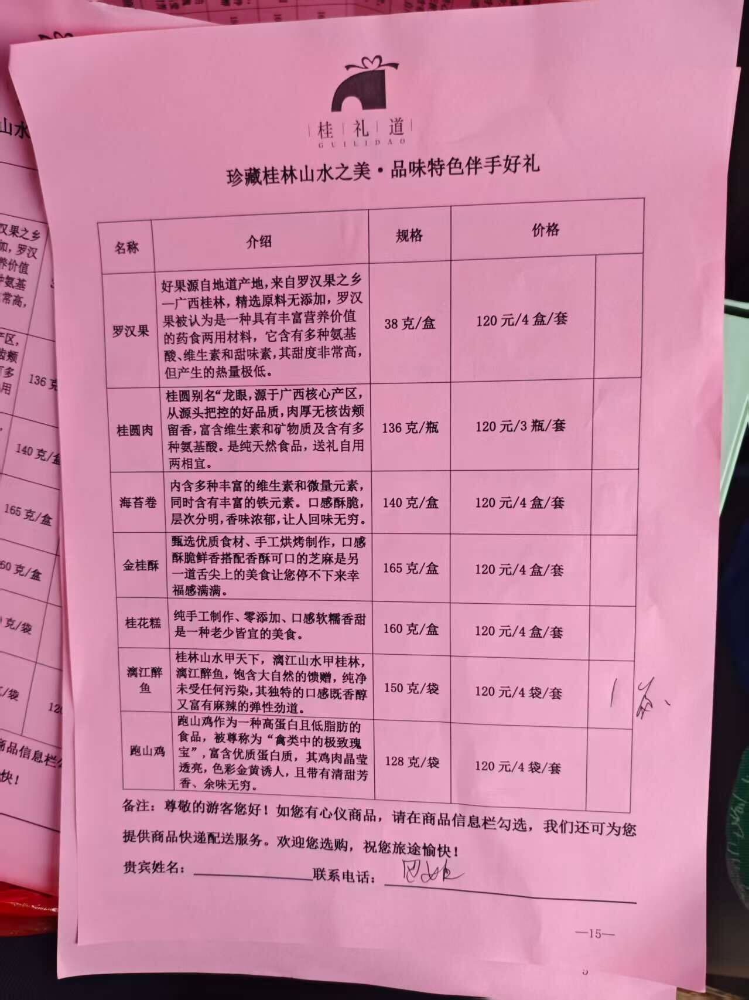
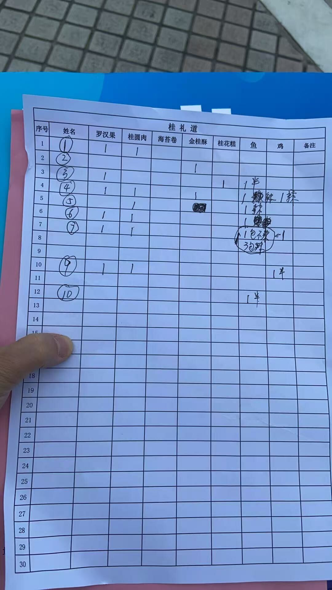

# 需求文档

## 项目概述

将桂礼道旅游特产的纸质下单流程（红单→白单→微信沟通）数字化为微信小程序。

## 现有流程

1. 导游向游客展示**红单**（商品菜单），包含商品名称、介绍、规格、价格
2. 游客选购后，导游手工汇总到**白单**（按序号记录每位游客购买的商品和数量）
3. 白单交给供货商，供货商按单发货
4. 配送地点（酒店、景点）通过微信沟通，地点经常变动

## 商品列表（当前）

| 名称 | 规格 | 价格 |
|------|------|------|
| 罗汉果 | 38克/盒 | 120元/4盒/套 |
| 桂圆肉 | 136克/瓶 | 120元/3瓶/套 |
| 海苔卷 | 140克/盒 | 120元/4盒/套 |
| 金桂酥 | 165克/盒 | 120元/4盒/套 |
| 桂花糕 | 160克/盒 | 120元/4盒/套 |
| 漓江醉鱼 | 150克/袋 | 120元/4袋/套 |
| 觅山鸡 | 128克/袋 | 120元/4袋/套 |

## 功能需求

### P0 - MVP

#### F1: 导游下单
- 创建团次（日期、团号、导游信息）
- 填写白单编号，选择商品和数量
- 自动生成汇总单（电子版白单）

#### F2: 供货商接单
- 收到订单推送通知（微信订阅消息）
- 查看订单详情（商品、数量、配送信息）
- 确认接单

#### F3: 配送信息
- 导游下单时选择发货方式：
  - 酒店送货（酒店名 + 房间号）
  - 景点自提（提货点）
  - 快递到家（收货地址）
- 常用地点库（可复用）
- 送达时间窗口

### P1 - 沟通与跟踪

#### F4: 订单备注
- 订单内双向留言板
- 新留言通知（订阅消息）

#### F5: 联系供货商
- 一键跳转微信联系

#### F6: 订单状态
- 状态流转：待确认 → 待发货 → 配送中 → 已送达
- 状态变更通知

### P2 - 管理

#### F7: 商品管理
- CRUD 商品信息
- 上下架控制

#### F8: 数据统计
- 按团次/日期/商品维度统计销量
- 导出报表

## 非功能需求

- 微信小程序平台
- 技术栈：Taro + React + TypeScript
- 支持离线下单（弱网环境），联网后同步
